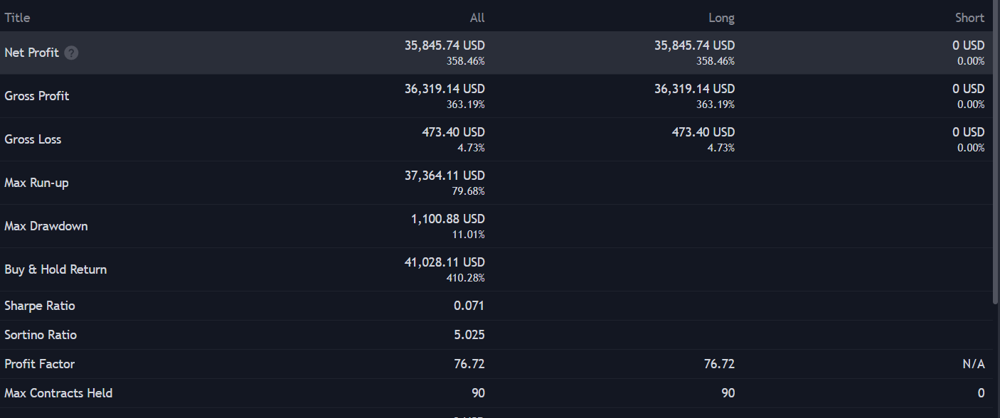

## Simple Moving Average Strategy

```javascript
//@version=5
strategy("Simple Moving Average Strategy", overlay=true, default_qty_type=strategy.percent_of_equity, default_qty_value=10)

// Define the time range
startDate = timestamp(2004, 7, 1, 0, 0)
endDate = timestamp(2024, 7, 1, 0, 0)
if (time < startDate or time > endDate)
    strategy.close_all()

// Input for moving average length
length = input(50, title="SMA Length")

// Calculate the Simple Moving Average
smaValue = ta.sma(close, length)

// Entry conditions
longCondition = ta.crossover(close, smaValue)
if (longCondition)
    strategy.entry("Long", strategy.long)

// Exit conditions
shortCondition = ta.crossunder(close, smaValue)
if (shortCondition)
    strategy.close("Long")

// Plot the SMA
plot(smaValue, color=color.blue, title="SMA")
```

This is the PineScript I wrote for the Simple Moving Average Strategy. Backtesting this on TradingView from the time 20 year span between July 1, 2004 and July 1, 2024 gave me the following results:



## Analysis

The Simple Moving Average strategy generated a net profit of $35,845.74 over 20 years, which is lower than the $39,694 made by SPY during the same period. While the strategy did return 358.46%, it couldn't outperform the basic buy-and-hold approach, which yielded a 410.28% gain. This indicates that the strategy wasn’t able to fully capture the long-term growth of the market.

The strategy's risk was controlled, with a maximum drawdown of 11.01%. However, the low Sharpe Ratio (0.071) suggests that the returns weren’t high enough for the level of risk taken. Overall, it is not a very effective strategy for beating SPY, and further adjustments would be needed to make it more competitive.